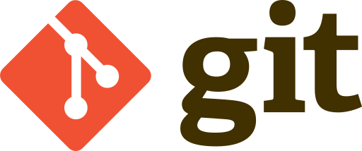

## What is git?

Git is what is known as a Version Control System (VCS). It was created by Linus Torvalds, partly out of spite of CVS (Concurrent Version System), another VCS. Linus, as many of you know, is known for writing the original Linux kernel - an open source implementation of UNIX.

## Why should I use a VCS?
Configuration management is very important in a world where large teams contribute to a single project. Without some sort of VCS, development would be a very slow and ineffective process. One would otherwise have to give the entire project up and allow the other person to make their own changes while *not* making changes him/herself. Think of it as tag teaming. While in some activities, this makes sense (like endurance activities), when it comes to software engineering, it makes more sense to allow for concurrent participation.

## Why use git?
Git allows developers to efficiently collaborate on software projects. The key word here is collaborate. On a larger scale, it is important to allow collaboration within teams without necessarily affecting the main repository. This is done by having distributed repositories where each computer has a copy of the repository.

## Why git has enlightened me
We had to collaborate on projects in ICS 111. We took a primitive approach to VCS and we would just send each other files as we went along. This method of collaboration was terrible and forced us to work on most of our code together, since we had to always make sure we weren't breaking each other's code.

Collaboration aside, git allows me to clean up my workspace and keep my projects organized. I can keep track of changes. The most important thing for me though is that I can use different machines to work on the same project. I used to use Dropbox to sync my projects. While this was convenient, this meant that I could not make ANY changes on two machines at the same time or it would break everything. This was because every file and every change was synced *immediately* after saving. There was only one single synced repository.
