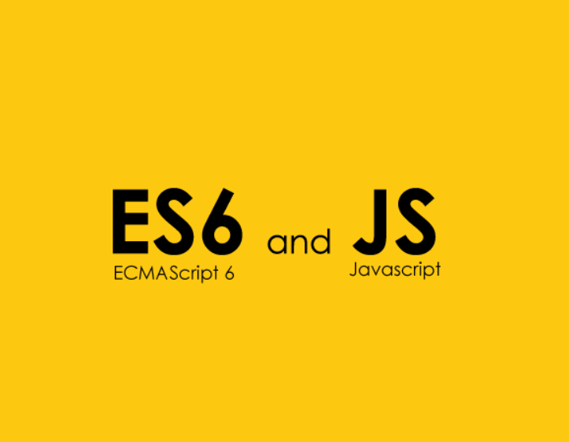

## Straight and to the point.

I do not like standards. Let us get this out of the way. I do however, like to read code when it conforms to standards. Yes kids, that would make me a walking double standard. I like it when other people do it, but I don't want to have to worry when writing code myself. I'm selfish. 

## I'm not stubborn!

I *will* do my best to write my code in-line with the expected standards, especially in class or when collaborating on projects. I completely understand why these standards exist. When working with others, the last thing you want to worry about is deciphering your teammates' code, just so you can *understand* what you are reading. If coding standards did not exist, it would be like being given an English assignment but the instructions were in Greek. 

## Why do I not like coding standards?

Coding standards are not hard to follow, especially with enough practice. My issue with them is how strict we must follow such rules. I think most people can write code that follow standards. I can see ,though, through my own efforts that the problem is with how we can not write things that follow older standards (like ES5). A big example is special for loops (let... of...). This is one of those things that I loved about JavaScript. It made writing for loops much simpler but ECMAScript 6 had to come and ruin my day. 

## Let's make friends with ECMAScript 6

While my attitude right now is generally negative towards ES6, I am willing to accept it and I will do my best to conform to it's finicky rules. I know it is for the better and it will make working with others much more rewarding. That, and I do believe that I should not live life a double standard. 