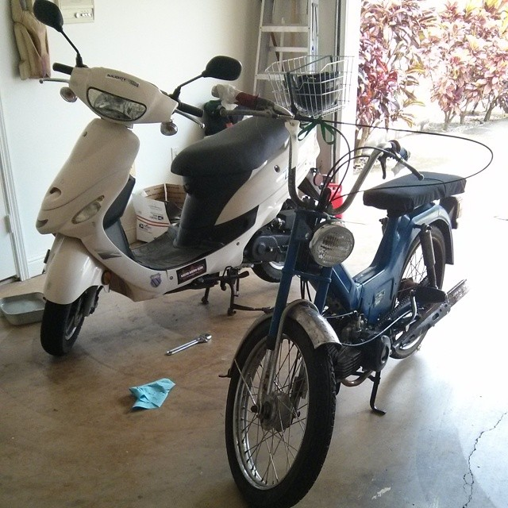

  

I always loved anything mechanical. When I was old enough to get a permit, I bought a moped. It was brand new but as with any vehicle produced these days, it was heavy and un-engaging. While it was reliable, I still wanted something fun and unique.

## Motorized Bicycle

Prior to all of this during one summer, a friend and I build a motorized bicycle. This wasn't any old motorized bicycle. This one has a gasoline engine. Most bikes out there have electric motors. While this was a fun project, it was difficult because things kept breaking. Bicycles were never meant to travel at highway speeds! Constantly repairing it got old fast.

## The purchase

Puch mopeds are hard to come by here in Hawaii. Most of them have rusted away after all these years. I found one guy who's hobby was restoring and building classic and custom mopeds. His name was Anthony. I knew what I wanted. After reading up on different models, I discovered that the Puch Maxi was the most common model sold in the US. It was a trade off because while that meant having one wouldn't be so unique, it did mean that getting parts for it wouldn't be too much of a hassle. I found Anthony and my grandparents came with me to his shop to pick up the bike.

## The bike and its issues

The moped did not run well when I bought it. Every bit of it was rusted, the suspension was terrible, and the engine and carburetor needed work. What I loved most about this bike was its simple design. The engine was not obscured by anything. It hung right out of the bottom of the frame.

You can learn more about *real* mopeds at the [Moped Army](http://www.mopedarmy.com/).
