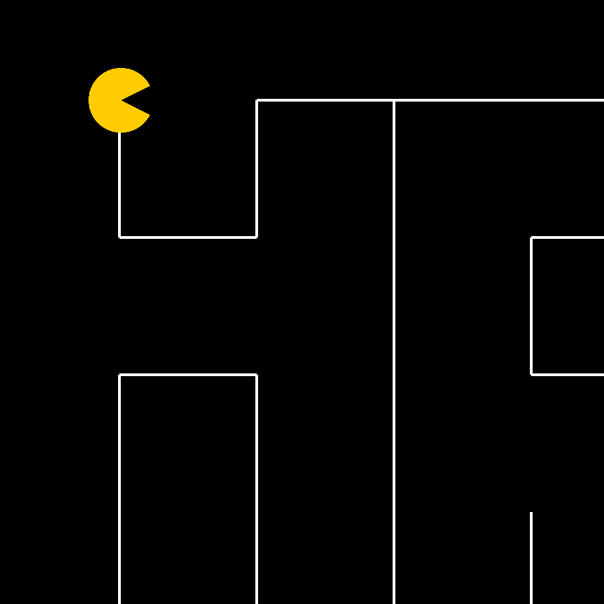

PAC MAN was what we called it. It really wasn't that similar to the actual PAC MAN game but we used him as the main character.

PAC MAN was implemented using Java and EZ Graphics. The goal of the game is to move the character to the end within a set amount of time.

I was responsible for the movement of the PAC MAN object on the screen and the logic behind the bounds within the lines.

You can watch a demonstration of it [here](https://youtu.be/HwvhAXWHtPg).

*I am not sure what the rules are about sharing code for a project that I do not fully own.*
